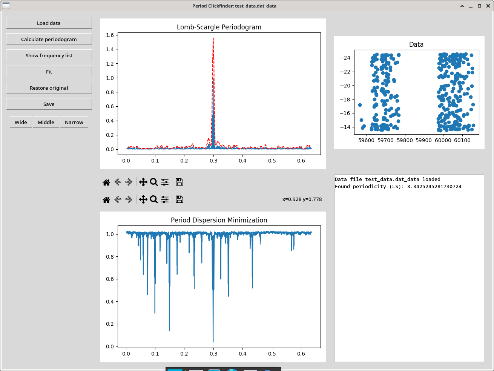
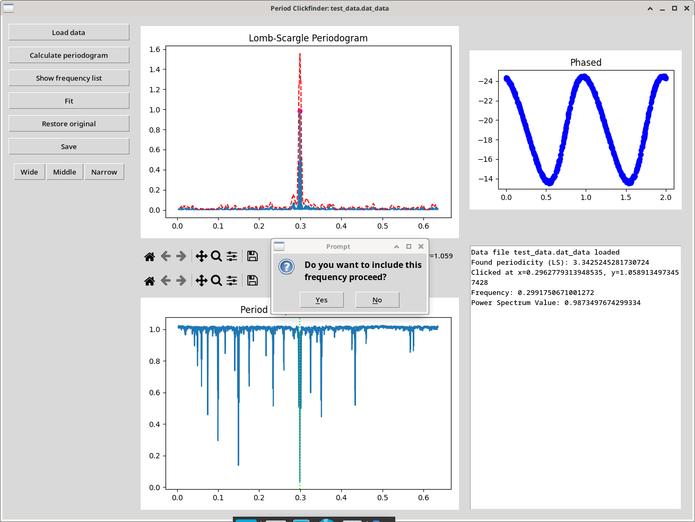
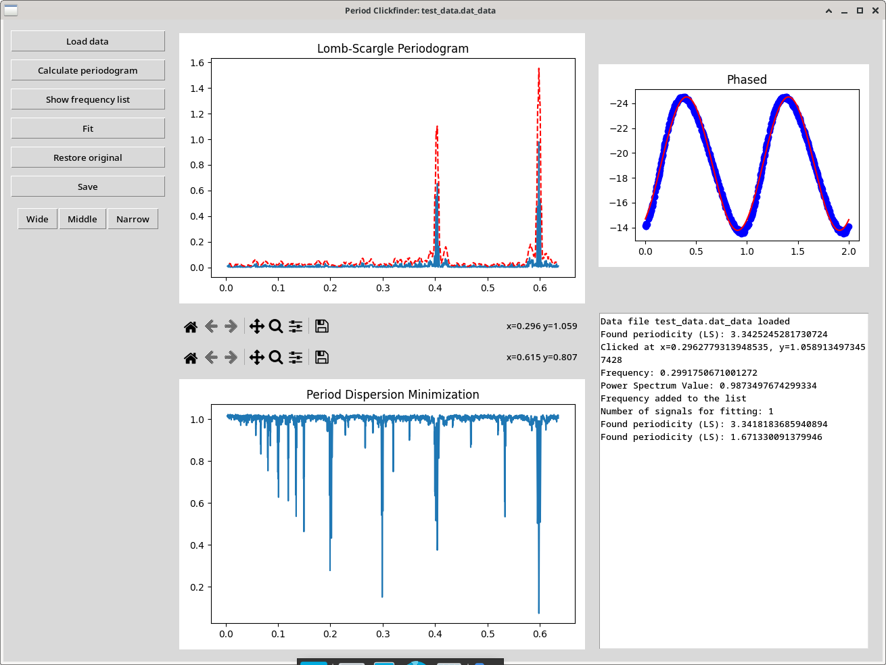

# PeriodClickfinder

GUI tool for time-series analysis. Lomb-Scargle periodogram (LSC) and Period Dispersion Minimization (PDM) are implemented. 

## Usage
Start the tool with
```
python period_clickfinder.py
```
and load the file with the Load button. Then to calculate LSC and PDM click on Calculate periodogram. The log window will report the highest signal in the LSC. Note, that LSC and PDM are calculated up to the Nyquist frequency.



User can click on the signals in LSC and PDM and the top right window will show data phased with the selected frequency. Frequency can be added to the frequency list for the further analysis.



The button Fit will initiate fitting of the frequency list. LSC and PDM of the residuals are automatically calculated and showed in the leftmost windows.



Output files are saved after clicking the Save button. These are:

- text file with first and last LSC and PDM periodograms (_lsc_first, _pdm_first, _lsc_last, _pdm_last)
- fitted frequency list with errors (_fit)
